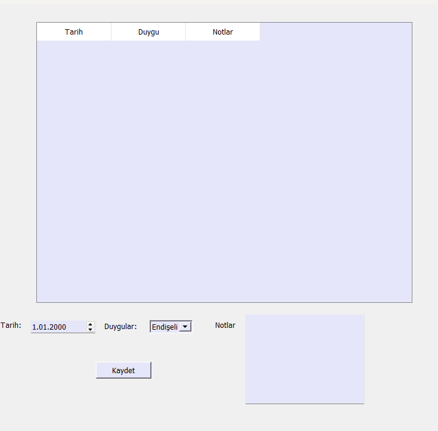

# zihin-bahcesi
# 🧠 zihin-bahcesi (Mind Garden)

**zihin-bahcesi** is a modern desktop application designed to help you organize your thoughts, notes, and daily habits in an orderly fashion.

## ✨ Features
* 📝 **Note Management:** Easily save and organize your thoughts and notes.
* 📈 **Habit Tracking:** Monitor your daily habits to build better discipline.
* 😊 **Mood Tracking:** Record your daily mood to observe your emotional progress.
* 🗄️ **Secure Data:** All your data is stored locally in a SQL database.

## 🛠️ Tech Stack
* **Language:** Python 3.x
* **UI Framework:** Qt Designer & PyQt5
* **Database:** SQLite

## 🚀 Installation & Usage
To run this project on your local machine, follow these steps:

1. **Clone or Download:** Clone this repository or download it as a ZIP file.
2. **Install Dependencies:** Open your terminal/command prompt and run the following command to install required libraries:
   ```bash
   pip install PyQt5

   Run the App: Launch the application by running the main entry file: python guncelmain.py
   Developed by: Merve Ciltepe

